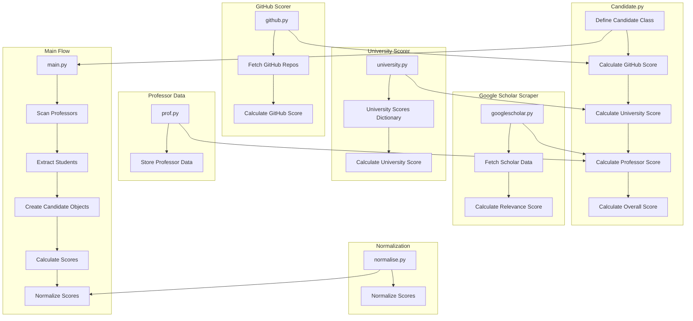

# AI Recruiter Project

## Overview

This project is an AI-driven recruitment tool designed to scrape and analyze GitHub and Google Scholar profiles to identify top candidates for AI and ML roles. The tool classifies input queries, fetches profile details, and ranks candidates based on their GitHub repositories and Google Scholar citations.

## File Structure

# Workflow, code structure

### `candidate.py`

Defines the `Candidate` class and methods to calculate scores based on GitHub activity, university, and other criteria.

### `github.py`

Fetches GitHub repositories, calculates repository scores, and aggregates them to provide an overall GitHub score for a user.

### `university.py`

Contains a dictionary of predefined university scores and methods to calculate university scores for candidates.

### `prof.py`

Stores professor data, including names, universities, and homepage URLs.

### `normalise.py`

Normalizes the scores of candidates and sorts them based on the overall normalized score.

### `googlescholar.py`

Fetches data from Google Scholar, calculates relevance scores, and provides citation information for profiles.

### `authors.py`

Scrapes co-authors from Google Scholar citations and returns a list of potential students and collaborators.

### `filter.py`

Filters out professors from the list of authors and classifies remaining individuals based on their roles and degree types.

### `student_scrape.py`

Fetches detailed information for students, including their GitHub and Google Scholar profiles, and creates `Candidate` objects.

### `requirements.txt`

Lists all the required Python libraries for the project, ensuring all dependencies are installed.

## Requirements

To set up the project environment, ensure you have Python installed and then install the required libraries using `requirements.txt`.

## Usage

### Setting Up

1. Clone the repository.
2. Create a virtual environment and activate it:
   <pre>

sh
<button class="flex gap-1 items-center"><svg xmlns="http://www.w3.org/2000/svg" width="24" height="24" fill="none" viewBox="0 0 24 24" class="icon-sm"><path fill="currentColor" fill-rule="evenodd" d="M7 5a3 3 0 0 1 3-3h9a3 3 0 0 1 3 3v9a3 3 0 0 1-3 3h-2v2a3 3 0 0 1-3 3H5a3 3 0 0 1-3-3v-9a3 3 0 0 1 3-3h2zm2 2h5a3 3 0 0 1 3 3v5h2a1 1 0 0 0 1-1V5a1 1 0 0 0-1-1h-9a1 1 0 0 0-1 1zM5 9a1 1 0 0 0-1 1v9a1 1 0 0 0 1 1h9a1 1 0 0 0 1-1v-9a1 1 0 0 0-1-1z" clip-rule="evenodd"></path></svg>Copy code</button>

<code class="!whitespace-pre hljs language-sh">python -m venv venv
   source venv/bin/activate  # On Windows: venv\Scripts\activate
   </code>

</pre>
3. Install the dependencies:
   <pre>

sh
<button class="flex gap-1 items-center"><svg xmlns="http://www.w3.org/2000/svg" width="24" height="24" fill="none" viewBox="0 0 24 24" class="icon-sm"><path fill="currentColor" fill-rule="evenodd" d="M7 5a3 3 0 0 1 3-3h9a3 3 0 0 1 3 3v9a3 3 0 0 1-3 3h-2v2a3 3 0 0 1-3 3H5a3 3 0 0 1-3-3v-9a3 3 0 0 1 3-3h2zm2 2h5a3 3 0 0 1 3 3v5h2a1 1 0 0 0 1-1V5a1 1 0 0 0-1-1h-9a1 1 0 0 0-1 1zM5 9a1 1 0 0 0-1 1v9a1 1 0 0 0 1 1h9a1 1 0 0 0 1-1v-9a1 1 0 0 0-1-1z" clip-rule="evenodd"></path></svg>Copy code</button>

<code class="!whitespace-pre hljs language-sh">pip install -r requirements.txt
   </code>

</pre>

### Running the Project

1. **Extracting Student Details:**
   Run `filter.py` to extract the list of students from the Google Scholar profiles of professors:

   <pre>

sh
<button class="flex gap-1 items-center"><svg xmlns="http://www.w3.org/2000/svg" width="24" height="24" fill="none" viewBox="0 0 24 24" class="icon-sm"><path fill="currentColor" fill-rule="evenodd" d="M7 5a3 3 0 0 1 3-3h9a3 3 0 0 1 3 3v9a3 3 0 0 1-3 3h-2v2a3 3 0 0 1-3 3H5a3 3 0 0 1-3-3v-9a3 3 0 0 1 3-3h2zm2 2h5a3 3 0 0 1 3 3v5h2a1 1 0 0 0 1-1V5a1 1 0 0 0-1-1h-9a1 1 0 0 0-1 1zM5 9a1 1 0 0 0-1 1v9a1 1 0 0 0 1 1h9a1 1 0 0 0 1-1v-9a1 1 0 0 0-1-1z" clip-rule="evenodd"></path></svg>Copy code</button>

<code class="!whitespace-pre hljs language-sh">python filter.py
   </code>

</pre>
2. **Scraping Student Details:**
   Run `student_scrape.py` to fetch additional details of students and score them:

   <pre>

sh
<button class="flex gap-1 items-center"><svg xmlns="http://www.w3.org/2000/svg" width="24" height="24" fill="none" viewBox="0 0 24 24" class="icon-sm"><path fill="currentColor" fill-rule="evenodd" d="M7 5a3 3 0 0 1 3-3h9a3 3 0 0 1 3 3v9a3 3 0 0 1-3 3h-2v2a3 3 0 0 1-3 3H5a3 3 0 0 1-3-3v-9a3 3 0 0 1 3-3h2zm2 2h5a3 3 0 0 1 3 3v5h2a1 1 0 0 0 1-1V5a1 1 0 0 0-1-1h-9a1 1 0 0 0-1 1zM5 9a1 1 0 0 0-1 1v9a1 1 0 0 0 1 1h9a1 1 0 0 0 1-1v-9a1 1 0 0 0-1-1z" clip-rule="evenodd"></path></svg>Copy code</button>

<code class="!whitespace-pre hljs language-sh">python student_scrape.py
   </code>

</pre>
3. **Processing Queries:**
   To classify input queries and fetch top profiles, run the query processing script: **This is the most relevant one and should be the only one of the user's concern. It calls other scripts and returns the suitable databse of candidates.**

   **Example usage query:**
